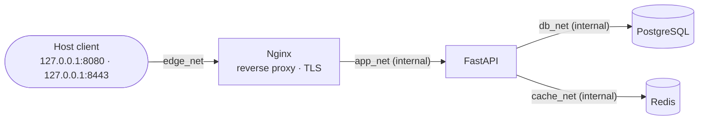

# secure-fastapi-lab

**Learn the networking behind a real backend by breaking it on purpose, then proving every fix.**

A FastAPI + PostgreSQL + Redis service behind Nginx, containerized and hardened, with a CI security pipeline. Every connection in the stack is predicted, tested, captured and explained. Vulnerabilities and misconfigurations are introduced deliberately, exploited, detected and fixed, documenting what scanners catch and what they miss.
   
The full plan can be found [HERE](Project_description/homelab_networking_plan.md) and the hardware I use can be found [HERE](Project_description/hardware.md)
   


> [!NOTE]
> This lab is being built in public. Chapters are published as they are completed; the [learning path](#the-learning-path) shows what's ready. v1.0 is due on **30 December 2026**.

---

## Why this exists

Most backend tutorials stop when the request returns `200`. Real incidents start when it doesn't:

- the API "hangs"
- a `502` appears for no obvious reason
- the rate limiter blocks everyone at once
- a container is "healthy" but unreachable

Fixing those requires knowing what actually happens between the components: DNS, routes, TCP, proxies, TLS. This lab teaches that with a small, realistic stack you can run on one Linux machine. Every claim is backed by a command output or a packet capture.

It's not a network-engineering course. It's the networking a backend or DevOps engineer needs to debug their own services with confidence.

## Highlights

A few of the experiments you'll run:

- **Prove segmentation, don't assume it.** Test every blocked flow by name *and* by IP, and see exactly which layer stops each packet.
- **Bypass a rate limiter with one header.** Forge `X-Forwarded-For`, defeat a Redis-backed limiter, then close the hole two different ways and learn why you keep both.
- **Watch TLS hide things.** Capture TLS 1.3 and TLS 1.2 side by side, and see the certificate travel in clear in one and not the other.
- **One status code, three root causes.** Three drills all end in `502`; tell them apart in under a minute.
- **Build Docker's networking by hand.** Recreate veth pairs, a bridge and a router with plain Linux namespaces, then recognize them inside Docker.

## The method

Every chapter follows the same loop:

```text
PREDICT  ->  write down what you expect before running anything
TEST     ->  run it
CAPTURE  ->  if reality surprises you, look at the packets
EXPLAIN  ->  write down why it happened, layer by layer
```

For every important connection, the goal is to answer ten questions:

<details>
<summary><b>The ten questions</b></summary>

1. Who initiates the connection?
2. What source IP and source port are used?
3. What destination IP and destination port are used?
4. How was the destination name resolved?
5. Which route is selected?
6. Is the destination on the same Layer-2 segment or behind a router?
7. Is NAT involved?
8. Which filtering or segmentation rule allows or blocks the flow?
9. Where is TLS terminated, if anywhere?
10. How can the answer be proven with a command or a packet capture?

</details>

## Architecture



| Design decision | Why |
|---|---|
| Only Nginx is published, and only on `127.0.0.1` | One ingress path; nothing reachable from the LAN by accident |
| FastAPI, PostgreSQL and Redis sit on internal networks | No route to the Internet; each service reaches only what it needs |
| Four networks with readable bridge names (`br-edge`, `br-app`, `br-db`, `br-cache`) | You always know which interface to capture on |
| Client identity is trusted only from the proxy network | Forwarded headers can't be forged from outside |
| TLS terminates at Nginx with a local lab CA | The CA private key is never mounted into any container |
| The Docker host is part of the trusted computing base | `internal: true` isolates containers from the Internet, not from the host |

## The learning path

Each chapter has a write-up in `docs/` that you can follow step by step.

| # | Chapter | You'll learn | Write-up | Status |
|---|---|---|---|---|
| 00 | **Host baseline** | Read your own machine's network before Docker changes it | `docs/host-network-baseline.md` | 🔨 in progress |
| 01 | **The workload** | A small FastAPI + PostgreSQL + Redis + Nginx stack with healthchecks, secrets and timeouts | `docs/architecture.md` | 🔨 in progress |
| 02 | **Docker networking** | Bridges, veths, namespaces, Docker DNS, a tested segmentation matrix, port publishing and NAT | `docs/docker-networking.md` | 📅 planned |
| 03 | **Linux primitives** | Build a veth pair, a bridge and a router by hand; capture ARP, ICMP, TCP, HTTP and Redis traffic | `docs/linux-network-primitives.md` | 📅 planned |
| 04 | **Proxies, identity and TLS** | Trusted forwarding headers, rate-limit spoofing, TLS termination, TLS 1.3 vs 1.2, timeouts (`499`, `502`, `504`) | `docs/proxy-client-ip.md` | 📅 planned |
| 05 | **Break it** | Eight failure drills, each diagnosed layer by layer | `docs/troubleshooting.md` | 📅 planned |
| 06 | **Security pipeline** | Gitleaks, Hadolint, Semgrep, Trivy; two deliberate vulnerabilities; threat model | `docs/vulnerabilities/` | 📅 planned |

Every write-up follows the same shape: **goal → setup → predictions → what happened → packet evidence → explanation → break it → takeaways**.

## Quick start

> [!WARNING]
> This lab contains deliberately vulnerable code and runs packet captures with `sudo`. Use a machine or VM you control, keep everything on `127.0.0.1`, and never expose `vuln/*` branches to a network.

### Requirements

| Requirement | Notes |
|---|---|
| A Linux host or VM | Bare metal or a VM. Docker Desktop on macOS or Windows hides the bridges inside its own VM, so the capture chapters won't match. How I built mine: [docs/lab-host-setup.md](docs/lab-host-setup.md) |
| Docker Engine 26.0+ | Older engines leak DNS out of internal networks ([CVE-2024-29018](https://nvd.nist.gov/vuln/detail/CVE-2024-29018)) |
| Docker Compose v2 | `docker compose`, not `docker-compose` |
| `sudo` | For `tcpdump`, `nsenter` and network namespaces |
| Host tools | `iproute2`, `tcpdump`, `dnsutils`, `netcat-openbsd`, `openssl`, `curl`; Wireshark optional |

### Run it

```bash
git clone https://github.com/mazarzycki/secure-fastapi-lab.git && cd secure-fastapi-lab

./scripts/make-secrets.sh          # generates local secrets (never committed)
./scripts/make-lab-certs.sh        # local CA + server cert (needed from chapter 04)
docker compose up -d --build

curl -s http://127.0.0.1:8080/health
```

On a headless lab host, run the stack there and reach it from your laptop through an SSH tunnel. The ports stay on the host's loopback:

```bash
ssh -L 8080:127.0.0.1:8080 -L 8443:127.0.0.1:8443 <user>@<lab-host>
```

With the tunnel open, the same `curl` works from the laptop.

The debug toolbox used throughout is `nicolaka/netshoot:v0.16`, joined to a container's network namespace, so the application images stay minimal:

```bash
docker run --rm -it --network container:api nicolaka/netshoot:v0.16
```

## Deliberate vulnerabilities

Each vulnerability lives on its own branch, with a write-up covering the change, the exploit, the observable symptom, what the scanners reported, why they did or didn't catch it, the fix and a regression test.

| Branch | What's broken | Scanner verdict |
|---|---|---|
| `vuln/forwarded-header-trust` | The proxy appends client-supplied `X-Forwarded-For` and the app trusts any sender, so clients can forge their IP and bypass rate limiting | published in chapter 06 |
| `vuln/sql-injection` | A search endpoint builds SQL from user input | published in chapter 06 |

The point isn't the exploits themselves. It's an honest record of which classes of problem automated tools find, and which ones only show up when you understand the system.

## What v1.0 will prove

By the v1.0 tag, each statement below is backed by a script output or a capture in the docs:

- FastAPI, PostgreSQL and Redis have no route to the Internet. This is tested by IP, not just by name.
- FastAPI reaches exactly two dependencies, and Nginx is its only ingress.
- No database, cache or API port is published to the host.
- Client identity is accepted only from the proxy network, and that boundary holds against forged headers from two different clients.
- Packet captures document ARP, Docker DNS, TCP, HTTP, TLS 1.3 and Redis RESP.
- Eight deliberately broken scenarios are diagnosed with a repeatable layer-by-layer method.

## Following along

If you want to learn from this lab rather than just read it:

1. **Fork it** and work through the chapters in order. Each one builds on the previous.
2. **Write your predictions before reading mine.** The learning happens in the gap between what you expected and what happened.
3. **Keep a lab journal** with the same template the write-ups use: goal, topology, prediction, commands, observation, explanation, open questions.
4. **Expect some differences.** Source addresses, firewall rules and DNS behavior can vary with your Docker version, firewall backend and host setup. When your result differs from mine, that's usually the most interesting part. Note your versions.
5. **Open an issue** if you find a wrong prediction, a broken command or a better explanation.

## Repository map

<details>
<summary>Show the layout</summary>

```text
secure-fastapi-lab/
├── app/                  FastAPI application
├── tests/                pytest suite (DB-free in CI)
├── migrations/           Alembic
├── nginx/
│   ├── default.conf      proxy, forwarded headers, timeouts, TLS
│   └── certs/            server cert + key only (generated, not committed)
├── pki/                  lab CA (generated, never mounted, not committed)
├── scripts/
│   ├── make-secrets.sh
│   ├── make-lab-certs.sh
│   ├── matrix.sh         segmentation matrix: by name, by IP, by layer
│   └── netns-*.sh        hand-built veth, bridge and router labs
├── docs/                 one write-up per chapter
│   └── lab-host-setup.md how the lab host (HP t740, Ubuntu Server 26.04) was built
├── captures/             sanitized capture notes (raw pcaps are not committed)
├── .github/workflows/    CI and the report-only workflow for vuln/* branches
├── compose.yml
└── Dockerfile
```

</details>

## Roadmap

**v1.0 (30 December 2026):** chapters 00–06, the full segmentation matrix, eight failure drills, two documented vulnerabilities, and a clean clone that works with the commands above.

**v1.1, the network track:** deeper networking once v1.0 ships, in dependency order:

1. static routing and longest-prefix match
2. manual NAT
3. stateful firewalling with nftables
4. Docker firewall internals
5. VLANs
6. OPNsense
7. macvlan and ipvlan
8. Redis over TLS
9. an IPv6 rebuild

---

Built and documented by Marek Zarzycki as a learn-in-public project. If it helped you understand something, a ⭐ helps others find it.
